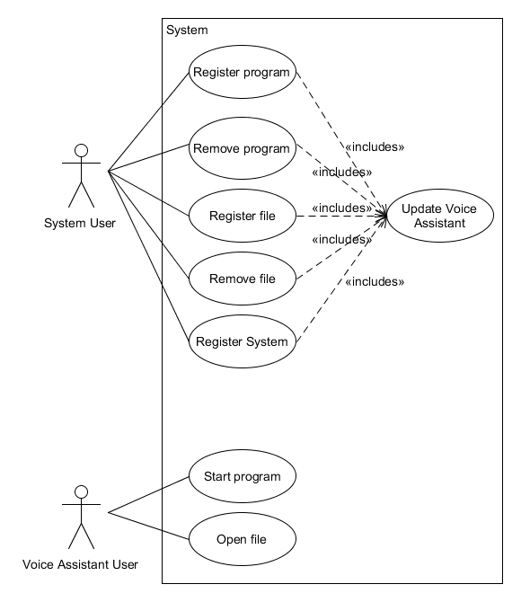

Bunny Box (Alexa/Google Home)
====================================
Pflichtenheft
-------------

Fachhochschule Bielefeld

Campus Minden

Studiengang Informatik

----------

Beteiligte Personen:

Name                   | Matrikelnummer
---------------------- | ---------------
**Projektleiter**      | 
Jan-Hendrik Sünderkamp | 1153536
**Team Alexa**         | 
Philipp Clausing       | 1078231
Devin-Alexander Meier  | 1087170
Tobias Muth            | 1077429
**Team Google**        | 
Peter Dick             | 1050185
Alexander Jaksties     | 1077474
Daniel Nagel           | 1085754

08. November 2017

----------

Softwarespezifikation
====================

Softwareanforderungen
---------------------
Fernsteuerung eines PC durch: Alexa, Google Home

Im Rahmen des Projektes soll eine Desktopanwendung realisiert werden, die die Steuerung eines Desktop-Computers mithilfe eines Voice Assistenten ermöglicht. Dazu müssen für die jeweiligen Voice Assistenten eigene Anwendungen entwickelt werden. Im Folgenden soll auf die Anforderungen eingegangen werden.

**Desktopanwendung**

Die wichtigeste Anforderung der Desktopanwendung ist die Konfigurierbarkeit der Anwendung selbst sowie verbundener Geräte. Dies soll über eine möglichst einfache und übersichtliche graphische Oberfläche realisiert werden. Bei Ladezeiten von über zwei Sekunden wird dem Nutzer ein optisches Feedback angezeigt. 
In der Oberfläche ist es dem Nutzer möglich neue Voice Assistenten, Programme, Befehle und Dateien hinzuzufügen. Beim Hinzufügen von Programmen sollen dem Nutzer mögliche Templates und bekannte Programme vorgeschlagen werden.
Um volle Funktionalität gewährleisten zu können muss die Anwendung ausgeführt werden.

**Voice Assistenten**

Die wichtigste Anforderung für die Voice Assistenten ist ein möglichst einheitliches Protokoll. Dieses ermöglicht verschiedene Voice Assistenten der Anwendung hinzuzufügen. Desweiteren sollen sich alle Geräte im selben Netzwerk befinden.

**Optionale Anforderungen**

Ein optionales Ziel ist das Ausführen von Kommandozeilenbefehlen und Skripten durch die Desktopanwendung.
Weiterhin kann optional eine Weboberfläche zur Bedienung der Anwendung zur Verfügung gestellt werden.
Der Voice Assistent könnte über ein externes System den Desktop-Computer starten.

Funktionale Anforderungen | Nichtfunktionale Anforderungen
------------------------- | -------------------------------
**Desktopanwendung** | 
Konfigurierbarkeit der Desktopanwendung | Selbsterklärende GUI der Desktopanwendung
Speichern von Pfadangaben, ausführbaren Dateiendungen und anderen Geräten |
Optisches Feedback bei Ladezeiten von über zwei Sekunden |
Standardbefehle für Programme |
Vorkonfigurationen für bekannte Programme |
Vorkonfigurationen für neue Programme (Templates) |
Eintragen neuer Programme |
Kommandozeilenbefehle & Skripte starten (o) |
Weboberfläche (o) |
**Voice Assistenten** |
Umsetzung innerhalb eines Netzwerkes | Möglichst einheitliches Protokoll (z.B. Open-HAB)
Wake on LAN (o) |

(o) - optional

----------

User Stories
------------
### Desktopanwendung

* Als Benutzer möchte ich eine intuitive Oberfläche der Desktopanwendung angezeigt bekommen, um keine Dokumentation lesen zu müssen.
* Als Benutzer möchte ich ein optisches Feedback bekommen, um zu wissen ob die Desktopanwendung mit ihrer Arbeit noch nicht fertig ist.
* Als Benutzer möchte ich Vorkonfigurationen für Programme angeboten bekommen, um Zeit zu sparen.
* Als Benutzer möchte ich vorgefertige Konfigurationen für neue Programme nutzen, um Zeit bei der Konfiguration zu sparen.
* Als Benutzer möchte ich Skripte ausführen können, um individuelle Operationen mit einem Befehl auszuführen.

### Voice Assistent

* Als Benutzer möchte ich meine Lieblingsprogramme mit meiner Stimme steuern, um meine Komfortabilität zu steigern.
----------

Use-Cases
---------

----------

Architekturdiagramm
-------------------

Das obige Diagramm stellt die Systemarchitektur dar. Auf der linken Seite des Diagramms sind vorerst nutzbare Voice Assistenten an ein lokales Netzwerk angebunden. Ziel ist es, dass beliebige Voice Assistenten an das finale System angebunden werden können. Über das Netzwerk wird eine Software auf einem PC-Client angesteuert. Diese Software soll sowohl bekannte Assistenten, als auch bekannte Programme speichern und verwalten können. Dazu bedient sie sich einer Datenbank.

Datenbankmodel
-------------------

Das obige Diagramm stellt die gespeicheten Daten in dem System dar. Ein Befehl kann keiner/em bis n Kategorien/Programmem zugeordnet werden. Eine Kategorie/Programm hat ein bis n Befehle. Ein Programm ist genau einer Kategeorie zugeordnet und einer Kategorie sind keine bis n Programme zugeordnet.
