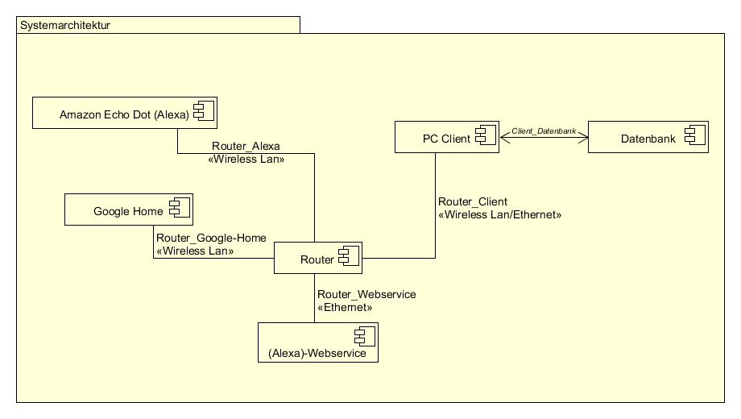

Software Projekt (Alexa/Google Home)
====================================
Pflichtenheft
-------------

Fachhochschule Bielefeld

Campus Minden

Studiengang Informatik

----------

Beteiligte Personen:

Name                   | Matrikelnummer
---------------------- | ---------------
**Projektleiter**      | 
Jan-Hendrik Sünderkamp | 
**Team Alexa**         | 
Philipp Clausing       | 
Devin-Alexander Meier  | 
Tobias Muth            | 
**Team Google**        | 
Peter Dick             | 
Alexander Jaksties     | 1077474
Daniel Nagel           | 

07. November 2017

----------

Softwarespezifikation
====================

Softwareanforderungen
---------------------
Fernsteuerung eines PC durch: Alexa, Google Home Mini

Funktionale Anforderungen | Nichtfunktionale Anforderungen
------------------------- | -------------------------------
Shutdown Timer | Möglichst einheitliches Protokoll (z.B. Open-HAB)
Konfigurierbarkeit der Desktop App | Selbsterklärende GUI der Desktop App
Umsetzung innerhalb eines Netzwerkes |
Speichern von Pfadangaben, ausführbaren |
Dateiendungen und anderen Geräten |
Optisches Feedback bei Ladezeiten |
Standardbefehle für Programme |
Vorkonfigurationen für bekannte Programme |
Vorkonfigurationen für neue Programme (Templates) |
Eintragen neuer Programme |
(Command chaining unterbinden) |
Wake on LAN (o) |
Kommandozeileninterpreter (o) |
Skripte starten (o) |

----------

User Stories
------------

----------

Use-Cases
---------

----------

Architekturdiagramm
-------------------

